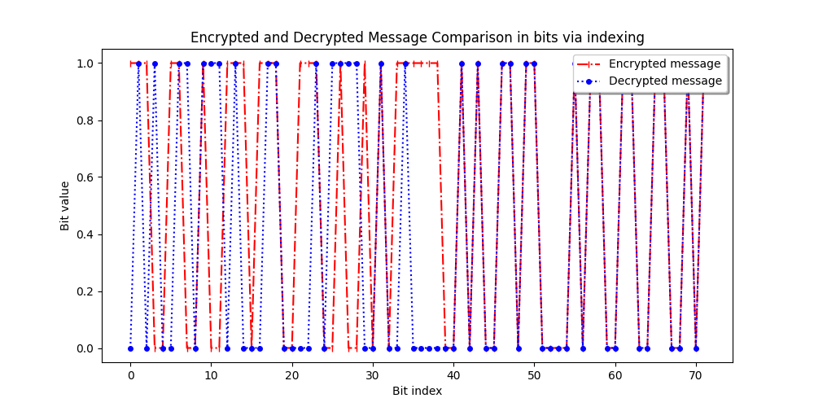

# Qubit by Qubit Capstone Project

# BB84 Quantum Key Distribution Protocol

This Python script implements the BB84 Quantum Key Distribution (QKD) protocol using the Cirq library. The BB84 protocol is a quantum cryptography protocol developed by Charles Bennett and Gilles Brassard in 1984 for secure communication.

Dependencies
The script requires the following Python libraries:

cirq==0.8.2
matplotlib==3.2.1
numpy==1.18.2
cirq-web==0.1.0

## Manual Installation:
**Requirements**

- Python 3.6 or higher
- Cirq library
- Matplotlib library

You can install these dependencies using pip:

pip install -r requirements.txt

## Features

- Simulates the BB84 protocol with a variable number of qubits.
- Calculates the Quantum Bit Error Rate (QBER) for each simulation.
- Plots the QBER as a function of the number of qubits.

## Usage

1. Clone the repository to your local machine.
2. Install the required libraries using pip:

```bash
pip install cirq matplotlib
```

3. Run the script:

```bash
python BB84_ex_corrected.py
```

## How it Works

The script simulates the BB84 protocol as follows:

1. Alice prepares a quantum state for each bit in the message.
2. Alice chooses a random basis to encode her bits and sends them to Bob.
3. Bob measures the received qubits in a random basis.
4. Alice and Bob publicly compare their bases. If they used the same basis to encode and measure a bit, they keep this bit as part of the key. Otherwise, they discard it.
5. The script calculates the QBER, which is the ratio of the number of bits in which Alice and Bob used the same basis but got different results, to the total number of bits where they used the same basis.

The script then plots the QBER as a function of the number of qubits.

{: width ="50%"}

## Note

This script is for educational purposes and simulates an ideal case. In a real-world scenario, the protocol would need to be adjusted to account for noise and potential eavesdropping.

## License

This project is licensed under the MIT License.


